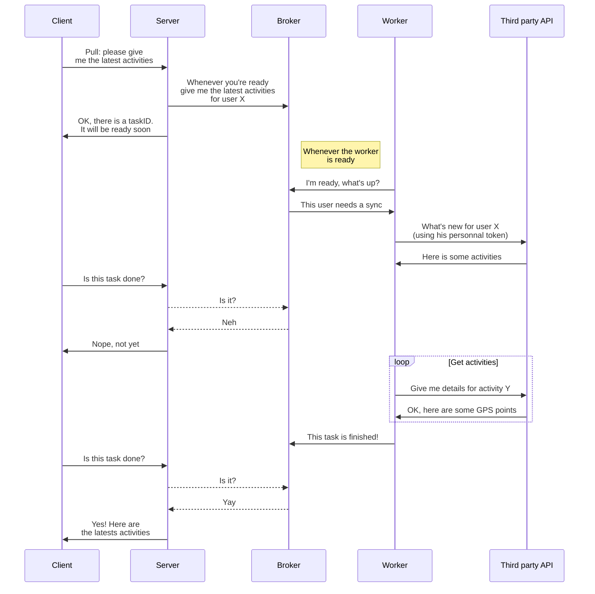

> After months of lockdown, running in circles around your block, always
> taking the same route, knowing every rock, every sidewalk or every
> pothole... Now it's time for the great outdoors! Go conquer new virgin
> territories, climb that hill or take that dead end... in short, get
> off the beaten track!
# Explore
Explore is an open-source conquest game that allows you to to **challenge your friends around a GPS map**. Each map is divided into "tiles" (a zone of 1km2). As soon as you **sync your favorite GPS application** after going for a run, you'll have all the new tiles you've encountered along the way - and that wouldn't be in the possession of one of your friends yet. At the end of the period, the user who has conquered the most zones wins the game!
# Backlog
Explore was developed with **MVP in mind** and is in continuous improvement, both technically and functionally. The next iterations are documented in this [github project](https://github.com/valentinbourgoin/explore/projects/1). The bugs are listed [here](https://github.com/valentinbourgoin/explore/projects/2).  

# Tech stuff
This repository contains both:
-  **`client/`**: the front-end (the registration module, the map, etc.)
- **`server/`**: the back-end (the API consumed by the application and the asynchronous GPS process tasks).

You'll be able to find the running documentation in each directory, but here is the details of the stack used. 
## Server
### Technical stack
- [Django](https://www.djangoproject.com/) with some cool libs (REST framework, AllAuth, etc).
- [Celery](https://docs.celeryproject.org/en/stable/django/first-steps-with-django.html) for each asynchronous tasks.
- [Redis](https://redis.io) as broker manager.  
- [PostGIS](https://postgis.net/) in order to store geospatial data and process them efficiently.
### Main principles

The Django app is divided in several apps:  

 - **`api/`**: All serializers and API views to communicate with the application. 
 - **`core/`**: All models, admin management and global functions. 
 -  **`map/`**: All things related to map processing and GPS parsing. 
 - **`tasks/`**: All Celery tasks to process things asynchronously.
 - **`explore/`**: The default running application.  

### Broker actions
In order to limit server response times and not to be dependent on processing times and other third party API responses, some routines are **performed asynchronously**. They are triggered by a user action (synchronization of an activity, creation of a map, ...) but can also be used via cronjobs. They are called "**tasks**", and transit on a queue in order to be processed as soon as the resources are free. More information [here](https://docs.celeryproject.org/en/stable/getting-started/introduction.html#:~:text=Dedicated%20worker%20processes%20constantly%20monitor,that%20message%20to%20a%20worker.). 

Example with a [pull order](https://github.com/valentinbourgoin/explore/blob/main/server/tasks/sync_activities.py) to some third party API (let's say Strava):
(Note: Mermaid flow diagram below. Image version [here](https://cln.sh/y1RIHV)).

## Client
### Technical stack
- NextJS
- Typescript - almost 😅
### Main principles
The frontend part uses [MaterialUI](https://mui.com/getting-started/usage/) as design system. Everything else has to be implemented! 
